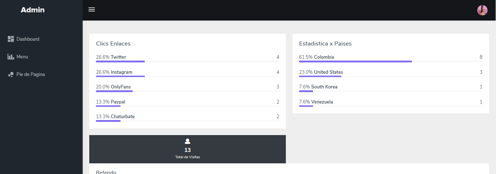
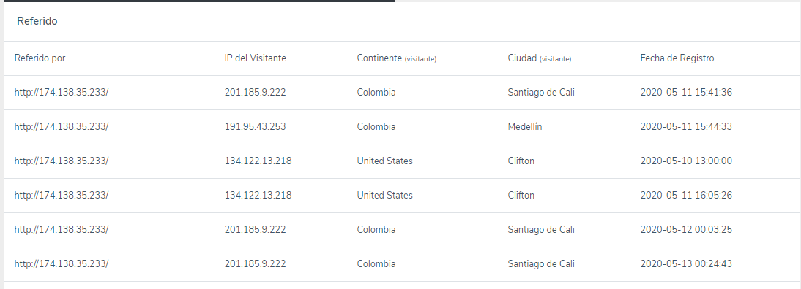
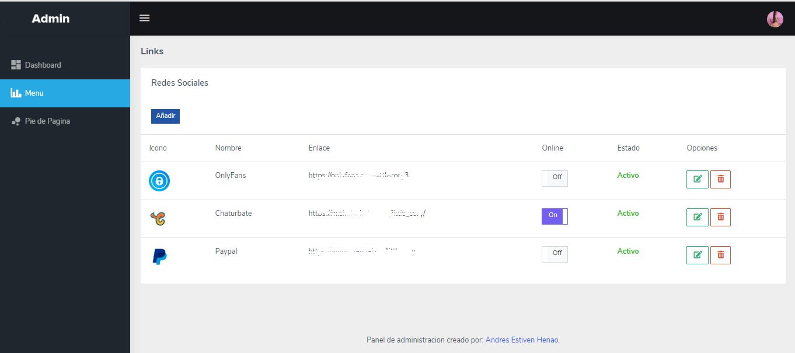
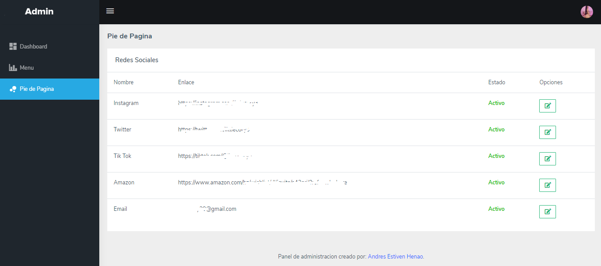

<h1> Linktr en Laravel </h1>

## Acerca de la App Web

Amigos a continuacion les traigo una version propia de lo que es la pagina web [Linktr](https://linktr.ee/), esta aplicacion web esta un poco personalizada debido a que fue un proyecto para un cliente.

Van a encontrar lo siguiente: 

- Pagina principal "index" la cual veran los visitantes, esta pagina cuenta con un fondo animado y enlaces que se agregan de forma dinamica desde el panel de administracion.
- Panel de administracion para agregar Menus, editar o eliminar. Tambien tiene la opcion de ponel el boton en un estado Online para que los visitantes tengan presentes que se encuentran activos en dicha red social.
- Contador de visitas y clic por IP, cada 24hrs el aplicativo permite registrar el mismo cliente,
- Dashboard de visitas totales, clics y visitas por mes.
- Interfaz para editar el perfil de usuario.

## ¿Para que sirve esta App?

La App de Linktr sirve como interfaz intermediaria entre el cliente y las distintas redes sociales que tenga la persona. De esta manera usted podra agregar solo 1 enlace a Instagram y cuando sus seguidores den Clic, vera una interfaz Web con muchos enlaces a sus distintas redes sociales e incluso podran identificar en la que usted se encuentra activo (si asi lo desea)

## Instalacion

Simplemente deben clonar el repositorio y ejecutar las migraciones de la BD.

## Contribuidores

Debido a que esto fue un proyecto para un cliente, lo hice muy ajustado a sus necesidades, pero si ustedes me ayudar a crear algo mas generico y personalizable desde la interfaz de administracion, pueden hacerlo y se los agradeceria.

Si me desea aportar algo por mi contribuccion con el codigo fuente de mi aplicacion, aqui dejo el link para Donar https://paypal.me/aehenao?locale.x=es_XC

## Capturas de Pantalla

## License GNU GPLv3

Los permisos de esta sólida licencia de copyleft están condicionados a poner a disposición el código fuente completo de obras con licencia y modificaciones, que incluyen obras más grandes que utilizan una obra con licencia, bajo la misma licencia. Los avisos de copyright y licencia deben conservarse. Los contribuyentes otorgan una concesión expresa de derechos de patente.
